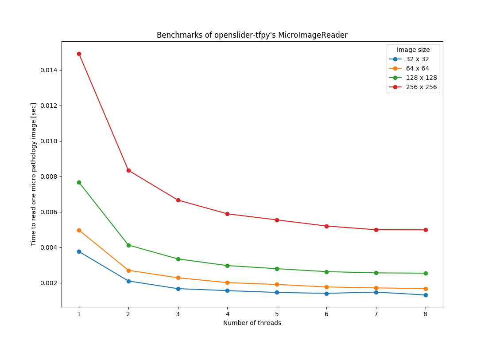

# openslider-tfpy

TensorFlow cunstom runner to read micro images from whole slide images.
This package uses openslide-python(https://openslide.org/api/python/)'s `read_region` function to produce tile images from whole slide images.

## Usage

This package is tested only for tensorflow 1.4.0.

~~~python
import tensorflow as tf

from openslidertfpy import MicroImageReader

openslide_read_region_params = [
    ((100, 100), 0),  # location and level for openslide's read_region func
    ((200, 200), 0),
    ((300, 300), 1)
]
image_width, image_height = 128, 128

with tf.Graph().as_default():
    coordinator = tf.train.Coordinator()
    runner = MicroImageReader(
        "sample.svs", coordinator, image_width, image_height
    )
    images, locations_batch, levels_batch = runner.get_inputs()
    # Define images, openslide's read_region function parameters

    results = some_op(images)  # Place your ML model here

    with tf.Session() as sess:

        # Some function to initialize values should be placed here

        # Start reading pathology images
        tf.train.start_queue_runners(sess)
        runner.start_thread(sess)
        while not coord.should_stop():
            actual_results, locs, levs = sess.run(
                [results, locations_batch, levels_batch]
            )
~~~

See `examples/read_region.py`.

## Benchmark

## Installation

Please install openslide to your system first.

~~~sh
$ python3 -m venv openslidertfpy-env
$ source openslidertfpy-env/bin/activate
$ python3 -m pip install git+https://github.com/OtaYuji/openslider-tfpy
~~~

Check the installation.

~~~sh
$ python3 -c "import openslidertfpy; print(openslidertfpy.__version__)"
~~~
